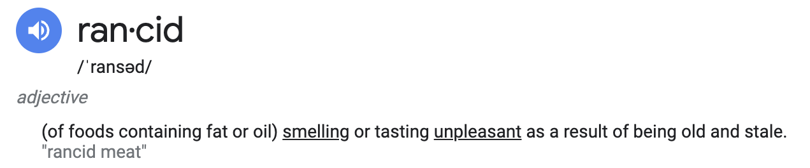

# rancid-syncer



## Generate apis

```bash
> kubebuilder init --domain k8s.appscode.com --skip-go-version-check
> kubebuilder edit --multigroup=true
> kubebuilder create api --group management --version v1alpha1 --kind Project --namespaced=false
```

## Rancher Monitoring

- rancher-monitoring from Cluster Tools
- Prometheus Federator
- Add labels to cluster AlertManager and Prometheus

- https://ranchermanager.docs.rancher.com/how-to-guides/advanced-user-guides/monitoring-alerting-guides/enable-monitoring#install-the-monitoring-application

- https://ranchermanager.docs.rancher.com/how-to-guides/advanced-user-guides/monitoring-alerting-guides/prometheus-federator-guides/enable-prometheus-federator
